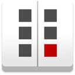

Mugshot
==============
A simple app for visual regression testing

REF: [Electron Boilerplate](https://github.com/szwacz/electron-boilerplate).  

# Release & Build

Builds the project into compiled files/folders, based on gulp tasks:
```
npm run build
```

To make ready for distribution installer use command:
```
npm run release
```
It will start the packaging process for operating system you are running this command on. Ready for distribution file will be outputted to `releases` directory.

## Special precautions for Windows
As installer [NSIS](http://nsis.sourceforge.net/Main_Page) is used. You have to install it (version 3.0), and add NSIS folder to PATH in Environment Variables, so it is reachable to scripts in this project (path should look something like `C:/Program Files (x86)/NSIS`).
